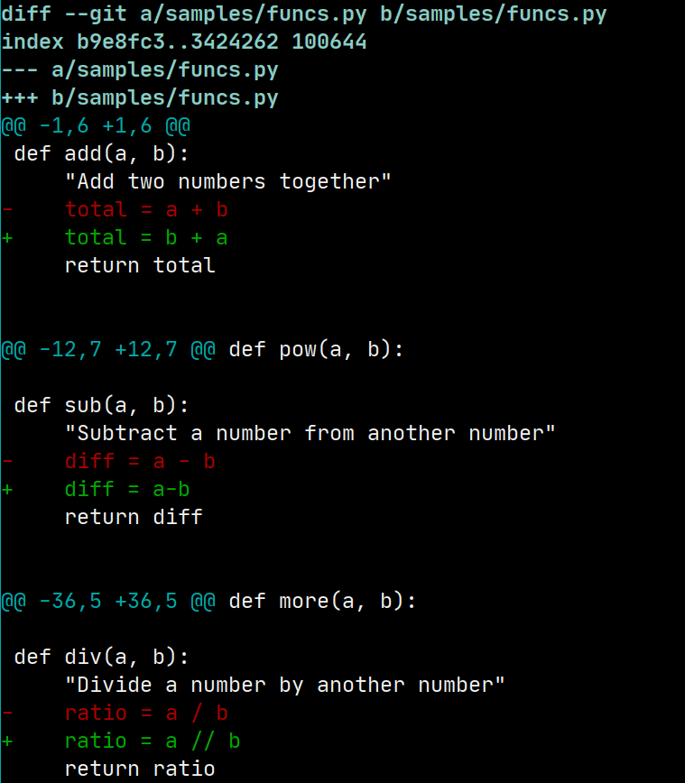
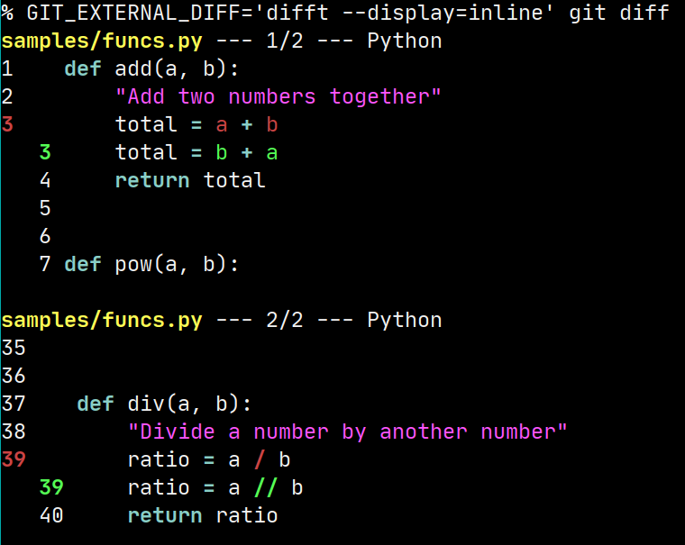
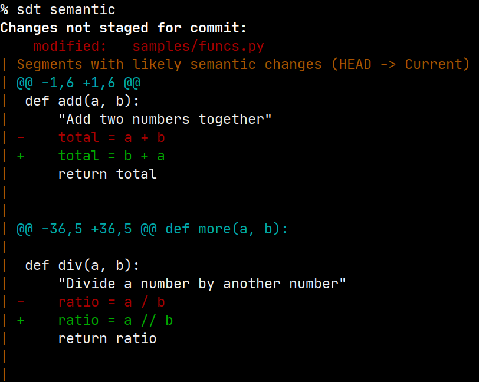

# Semantic Diff Tool (sdt)

The command-line tool `sdt` compares source files to identify which
changes create semantic differences in the program operation, and
specifically to exclude many changes which cannot be *functionally
important* to the operation of a program or library.

Use of `sdt` will allow code reviewers or submitters to assure that
modifications made to improve stylistic formatting of the code—whether
made by hand or using code-formatting tools—does not modify the underlying
*meaning* of the code.

As designed, the tool is much more likely to produce false positives for
the presence of semantic changes than false negatives.  That is to say,
`sdt` might indicate that a certain segment of the diff between versions
is *likely* to contain a semantic difference in code, but upon human
examination, a developer might decide that no actual behavior will change
(or, of course, she might decide that the change in code behavior is a
desired change).

It is unlikely that `sdt` will identify an overall file change, or any
change to a particular segment of a diff as semantically irrelevant where
that change actually does change behavior.  However, this tool provides NO
WARRANTY, and it remains up to your human developers and your CI/CD
process to make final decisions on whether to accept code changes.

## Installation

If the Go language is installed on your system, you may install `sdt` by
cloning this repository, and installing the tool using `go install ./...`.
For example:

```bash
% git clone https://github.com/atlantistechnology/sdt.git
% cd sdt
% go install ./...
```

These commands will install both `sdt` itself and also the small support tools
`jsonformat`, `gotree`, and `treesit` that may be used to evaluate changed 
JSON, Golang, and tree-sitter grammar files, respectively.  Additional similar 
tools are likely to be added to this repository as new languages are supported.

However, you may also simply download pre-built binaries for all available
Go cross-compilation targets directly to your system path.  For example,
on a Linux operating system and an AMD64 architecture, you might download
with:

```bash
% sudo curl https://sdt.dev/linux/amd64/sdt > /usr/local/bin/sdt
% sudo curl https://sdt.dev/linux/amd64/jsonformat > /usr/local/bin/jsonformat
% sudo curl https://sdt.dev/linux/amd64/gotree > /usr/local/bin/gotree
% sudo curl https://sdt.dev/linux/amd64/treesit > /usr/local/bin/treesit
% sudo chmod a+x /usr/local/bin/sdt \
  /usr/local/bin/jsonformat /usr/local/bin/gotree /usr/local/bin/treesit
```

The extra tool `jsonformat` is not needed for users who prefer to use the
much more powerful [`jq`](https://stedolan.github.io/jq/) in their
`.sdt.toml` configuration.  The tool `gotree` produces a somewhat customized
parse tree, so a different tool is unlikely to be compatible with `sdt`.

The separate step of setting the "executable bit" is probably not needed,
but does no harm.  If you are installing to a PATH that only needs user 
permission, the `sudo` is not necessary.

## Integrations

### Subcommand of git

You may wish to use `sdt` as a `git` subcommand.  To do so, you can create
an alias under either locally within `<repo>/.git/config` or globally within
`$HOME/.gitconfig`, depending on which better suits your workflow.

A straightforward and useful alias can provide something akin to an
enhanced `git diff`.  This alias will either compare current files to the
`HEAD` of the working branch, compare current files to another branch, or
compare to branches/revisions to each other.  For example:

```
% git sdt
INFO: Comparing HEAD to current changes on-disk
Changes not staged for commit:
    modified:   .gitignore
| No available semantic analyzer for this format
    modified:   README.md
| No available semantic analyzer for this format
```

```
% git sdt f7f6b934 ruby-samples
INFO: Comparing branches/revisions f7f6b934: to ruby-samples:
Changes between branches/revisions:
    samples/simple-filter.rb
| Segments with likely semantic changes
| @@ -3,6 +3,4 @@
|    items.to_a.select {|item| item % 5 == 0}
|  end
|
| -puts mod5? 1..50
| -puts mod5? 1..101
| -
| +puts mod5? 1..100
```

The alias for this behavior is:

```toml
[alias]
    sdt = "!f() { \
        if [ -z \"$1\" ]; then A=''; else A=\"--src $1:\"; fi; \
        if [ -z \"$2\" ]; then B=''; else B=\"--dst $2:\"; fi; \
        sdt semantic $A $B; }; f"
```

### Checking within GitHub Action

You may wish to have a semantic analysis of changes performed along with every
PR.  This can be accomplished using a GitHub Action, or in an analogous way on
other repository management services such as GitLab or BitBucket.  A GitHub
Action could look like the below (and such is used in the repository for SDT
itself; note you only need the middle steps of building the internal tools if 
your project includes JSON or Go). The "Analyze semantic changes" step will 
always be needed.  If you want to use tree-sitter grammars and/or custom 
versions of SDT-supported programming languages, you will need to install those
within the workflow.

Since this is a GH Action for the `sdt` repo itself, we build the underlying
tool(s) in the workflow. For an unrelated repository, you should simply follow
the installation instructions, as you would for installation to a local 
development workstation, and include those steps in the YAML file.

```yaml
name: Semantic Diff Tool analysis in PR comment

on:
  pull_request:

jobs:
  pr:
    runs-on: ubuntu-latest
    permissions:
      pull-requests: write
    steps:
      - uses: actions/checkout@v3
        with:
          fetch-depth: 2

      - name: Set up Go
        uses: actions/setup-go@v3
        with:
          go-version: 1.19

      - name: Build jsonformat tool
        run: |
          go build -o "$GITHUB_WORKSPACE/jsonformat" cmd/jsonformat/main.go &&
          echo "$GITHUB_WORKSPACE/" >> $GITHUB_PATH

      - name: Build gotree tool
        run: |
          go build -o "$GITHUB_WORKSPACE/gotree" cmd/gotree/main.go &&
          echo "$GITHUB_WORKSPACE/" >> $GITHUB_PATH

      - name: Analyze semantic changes
        id: pr
        run: |
          new=$(git log | grep 'Merge.*into.*' | head -1 | sed 's/ into .*$//;s/^ *Merge //')
          old=$(git log | grep 'Merge.*into.*' | head -1 | sed 's/^.* into //')
          status=$(go run cmd/sdt/main.go semantic -A "${old}:" -B "${new}:" -m -d)
          echo "Comparing revision $old to $new" >> SDT.analysis
          echo "<pre>" >> SDT.analysis
          echo "$status" >> SDT.analysis
          echo "</pre>" >> SDT.analysis
          echo "$status" # Workflow sees the report also
          
        env:
          GITHUB_TOKEN: ${{ secrets.GITHUB_TOKEN }}

      - name: Add a comment to the PR
        uses: mshick/add-pr-comment@v2
        with:
          message-path: SDT.analysis
```

## Related tools

### Difftastic

[Difftastic](https://github.com/Wilfred/difftastic) (`difft`) serves a
largely overlapping purpose to `sdt`.  Difftastic builds on the substantial
and longstanding work in
[tree-sitter](https://github.com/tree-sitter/tree-sitter), which is a parser
generator tool for which many grammars and interfaces have been created.

Semantic Diff Tool is much newer and less developed; but `sdt` also takes a
much more heuristic approach.  That is, `difft` will answer the question
"*exactly* what has changed between these two versions of a file at an AST
level?"  In contrast, `sdt` aims to answer the somewhat narrower question
"which segments of the diff are likely to be semantically important?"
Specifically, `sdt` is meant to aid code reviewers in excluding merely
stylistic changes and focus on (likely) functional changes.

This difference is reflected in the different approaches to comparing files
the two tools take.  Instead of relying on fixed and compiled-in versions of
parsers as `difft` does, `sdt` dynamically calls external tools (which can
be whichever specific version of those is used by a project).  

As a consequence, using `difft` with a project that, e.g., utilizes Python
3.8 is difficult to impossible.  At the least, it would require recompiling
the Rust tool with dependencies on whichever older version of
[tree-sitter-python](https://github.com/tree-sitter/tree-sitter-python) has
specifically 3.8-level syntax.  In contrast, `sdt` can be easily and
dynamically configured to utilize an appropriate Python executable, such as
`/usr/local/bin/python3.8`.

As an illustration, in the following screenshots, `git diff` shows three
segments where surface changes were made to a small test file.  The first
and third—but not the second—segment is semantically meaningful to what the
program does.  Both `difft` and `sdt` correctly identify this fact; but
`sdt` presents a display closely modeled on `git diff` itself while `difft`
highlights *exactly* those characters that represent a change (using a
somewhat idiosyncratic, but clear, format).  These examples are included as
screenshots rather than as marked text to preserve the use of color
highlighting by all three tool.

```
% git diff
```



```
% GIT_EXTERNAL_DIFF='difft --display=inline' git diff
```



```
% sdt semantic
```



### AST Explorer

[AST Explorer](https://github.com/fkling/astexplorer) is somewhat similar in
concept to Difftastic.  It is written in JavaScript, and uses
language-native parsers to support numerous programming languages.  It does
not attempt to provide diff'ing, but adding that would be relatively
straightforward.  That was, in fact, the initial but discarded approach
taken by the creator of `sdt`.

However, after some initial development, I realized that the quality of the
third-party JS parsers that AST Explorer utilizes are often poor, and fail
to recognize many commonplace constructs of the languages they respectively
process.  AST Explorer itself exposes a very nice [web-based front
end](https://astexplorer.net/), but beyond the sample files of many source
languages it provides, the tool often fails to parse valid source code.

# Supported languages

Much of the work that Semantic Diff Tool accomplishes is done by means of
utilizing other tools.  You will need to install those other tools in your
development environment separately.  However, this requirement is generally
fairly trivial, since the tools used are often the underlying runtime
engines or compilers for the very same programming languages of those files
whose changes are analyzed (in other words, the programming languages your
project uses).

The configuration file `$HOME/.sdt.toml` allows you to choose specific
versions of tools and specific switches to use.  This is useful especially
if a particular project utilizes a different version of a programming
language than the one installed to the default path of a development
environment.  Absent an overriding configuration, each tool is assumed to
reside on your $PATH, and a default collection of flags and switches are
used.

For example, for Ruby files, the default command `ruby --dump=parsetree` is
used to create an AST of the file being analyzed.  Similarly, for Python
files, `python -m ast -a` is used for the same purpose.  Other tools produce
canonical representations rather than ASTs, depending on what best serves
the needs of a particular language (and depending on what tools are
available and their quality).  While overriding the configuration between
different version of a programming language or tool will *probably* not
break the code that performs the semantic comparison, not all languages have
been tested in all versions (especially for versions that will be created in
the future and do not yet exist).

## Ruby

Initial support created.  Supports both `semantic` and `parsetree` subcommands.

Only a `ruby` interpreter is required (by default)

## Python

Initial support created.  Supports both `semantic` and `parsetree` subcommands.

Only a `python` interpreter is required (by default)

## SQL

Initial support created.  Uses canonicalization rather than parsing, so
only the `semantic` subcommand is supported.

Requires the tool `sqlformat` (by default).  See:

* https://github.com/andialbrecht/sqlparse
* https://manpages.ubuntu.com/manpages/jammy/man1/sqlformat.1.html

## JavaScript

Initial support created.  Supports both `semantic` and `parsetree`
subcommands.

Requires the `node` interpreter and the library `acorn` (by default). See:

* https://github.com/acornjs/acorn/tree/master/acorn/

Use of the error-tolerant variant `acorn-loose` was contemplated and
rejected (as a default).  We believe this tool would be more likely to
produce spurious difference in parse trees. See:

* https://github.com/acornjs/acorn/tree/master/acorn-loose/

Note that Node 18.10 was used during development. However, any node version
supported by Acorn should work identically.  However, if you wish to treat
the files being analyzed as a specific ECMAScript version, see the option
`ecmaVersion` that can be configured in `.sdt.toml` and is discussed in the
sample version of that file.

## JSON

JSON is supported by the bundled tool `jsonformat` which uses the internal
Go library `json` to canonicalized documents.  The much more sophisticated,
and commonly installed third-party tool `jq` may also be used, and is
illustrated within the sample `.sdt.toml`.

## Golang

Go is supported by the bundled tool `gotree` which uses the internal Go
libraries `go/ast`, `go/parser`, and `go/token`.  The parse tree format
produced by this tool is designed to make the work SDT does easy, but
another library is very unlikely to produce a format compatible with the
assumptions made in evaluating this parse tree.

## Tree-Sitter languages

The widely used parser generator `Tree-sitter` has had a great many grammars
designed for it. This tool is used by the Atom editor and by GitHub in its
code highlighting and analysis facilities. As noted relative to Difftastic, 
these grammars are all at "some version of the language" rather than allowing
an arbitrary version to be configued; however, by utilizing this tool, SDT
gets support for 63 languages (at time of this writing; some grammars more 
complete than others).

Installing the command-line tool `tree-sitter` requires building a project
using Rust's `cargo` or Node.js' `npm`, and generating each grammar 
requires that Node.js is installed.  A C compiler is also needed to build 
the core parser.

There are a number of moving pieces needed to install each supported
language, but the instructions in [the tree-sitter project
documentation](https://tree-sitter.github.io/tree-sitter/) are fairly
straightforward.  If no more specialized language parser is defined in SDT
specific code, a final effort is made to use the bundled tool `treesit` to
produce a parse tree for a modified file.

The tool `treesit` wraps a call to `tree-sitter parse`, and merely massages
the output slightly to produce a format compatible with that produced by
`gotree`.  This allows SDT to produce semantic analysis for all languages
having installed tree-sitter grammars.  Available grammars include:

	* Agda
	* Bash
	* C
	* C#
	* C++
	* Common Lisp
	* CSS
	* CUDA
	* D
	* Dockerfile
	* DOT
	* Elixir
	* Elm
	* Emacs Lisp
	* Eno
	* ERB / EJS
	* Erlang
	* Fennel
	* GLSL (OpenGL Shading Language)
	* Go
	* Go mod
	* Hack
	* Haskell
	* HCL
	* HTML
	* Java
	* JavaScript
	* JSON
	* Julia
	* Kotlin
	* Lua
	* Make
	* Markdown
	* Nix
	* Objective-C
	* OCaml
	* Org
	* Perl
	* PHP
	* Protocol Buffers
	* Python
	* R
	* Racket
	* Ruby
	* Rust
	* Scala
	* S-expressions
	* Sourcepawn
	* SPARQL
	* SQL
	* Svelte
	* Swift
	* SystemRDL
	* TOML
	* Turtle
	* Twig
	* TypeScript
	* Verilog
	* VHDL
	* Vue
	* WASM
	* WGSL WebGPU Shading Language
	* YAML

## Others

What do you want most?

